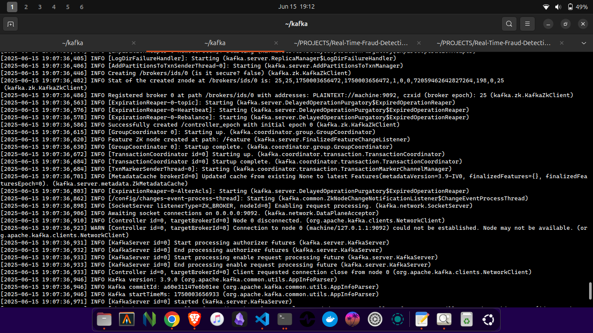

# Real-Time Fraud Detection with Apache Kafka

This project demonstrates a simple real-time fraud detection system using Apache Kafka. It produces synthetic transaction data, applies basic fraud detection rules, and prints alerts for suspicious transactions.

## Components

1. **transactions_producer.py**  
   - Generates random transaction data using the Faker library
   - Sends data to a Kafka topic named `transactions`
   - Fields include: user_id, amount, location, and timestamp
   - Produces one transaction per second to simulate real-time flow

2. **transactions_consumer.py**  
   - Consumes transaction messages from the Kafka topic
   - Evaluates each transaction using fraud detection logic
   - Prints whether the transaction is legitimate or fraudulent
   - Uses Kafka's auto-commit feature to track processed messages

3. **rules.py**  
   Contains the logic for flagging suspicious transactions. Current rules:
   - Transaction amount > $1000
   - Transaction originates from a high-risk country (Nigeria, India, Russia, etc.)

## Requirements

- Python 3.x
- Apache Kafka running on localhost:9092
- Python packages:
  - kafka-python
  - faker

## Installation and Setup

1. Install Python dependencies:
   ```bash
   pip install kafka-python faker
   ```
2. Start Zookeeper and Kafka servers (assuming Kafka is installed locally):

 - ##### Start Zookeeper
  ```bash
  bin/zookeeper-server-start.sh config/zookeeper.properties
  ```
 - ##### Start Kafka
  ```bash
  bin/kafka-server-start.sh config/server.properties
  ```
3. Create the transactions topic
```bash
bin/kafka-topics.sh --create --topic transactions --bootstrap-server localhost:9092 --partitions 1 --replication-factor 1
```
4. Run the producer in one terminal:
   - The producer shows every transaction it creates.
```bash
python transactions_producer.py
```
5. Run the consumer in another terminal:
   - The consumer categorizes each transaction as either fraudulent or legitimate based on the rules in `rules.py`.
```bash
python transactions_consumer.py
```

### Zookeeper screenshot


### Kafka Server screenshot



### Producer Screenshot


### Consumer Screenshot


### Fraud Detected Screenshot


